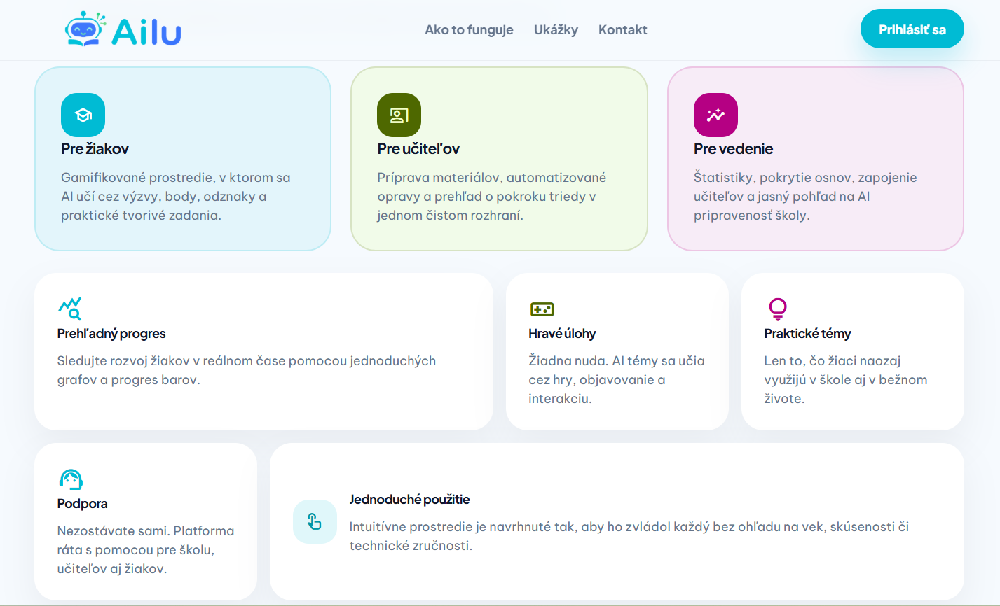
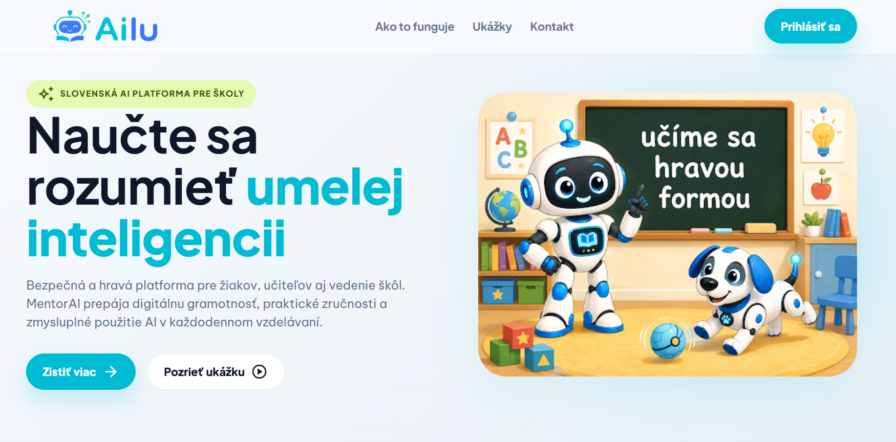
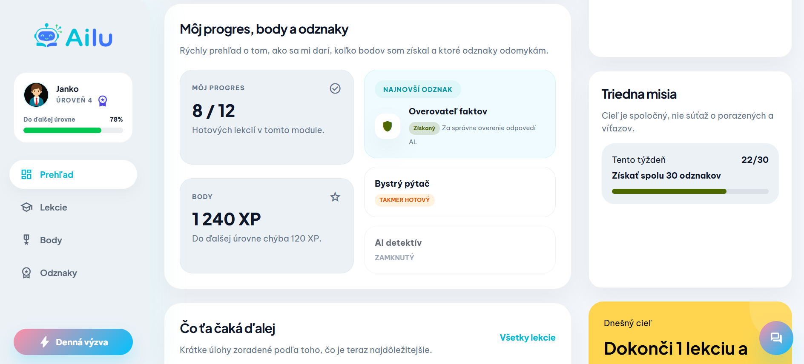
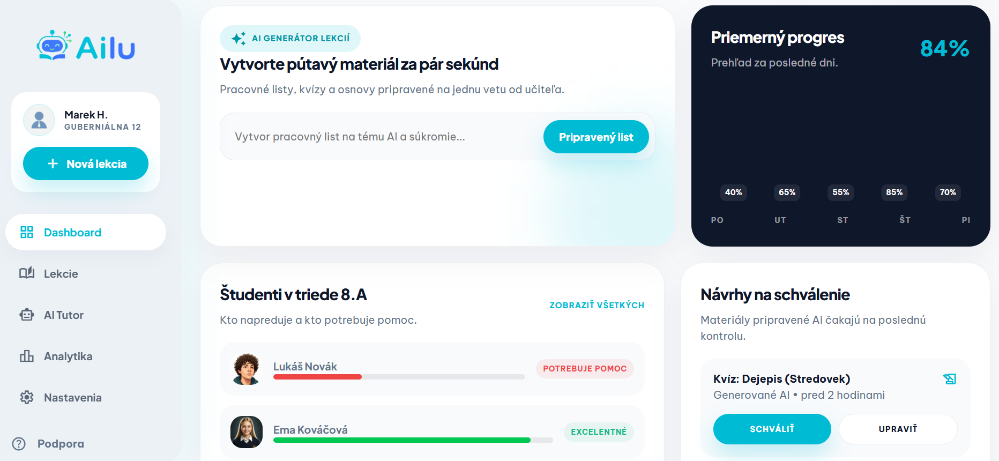
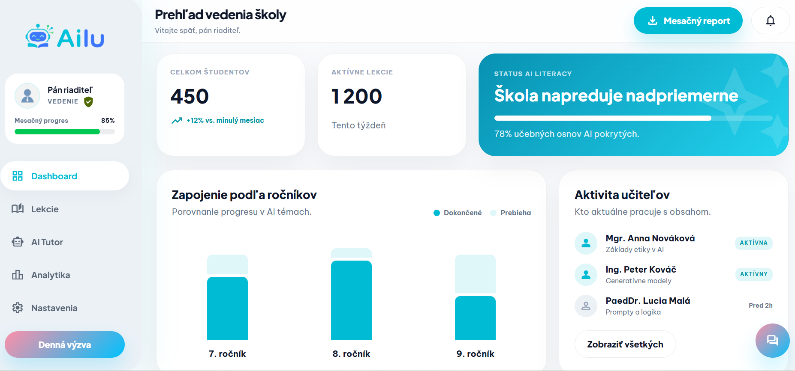

# Ailu.sk

Status: Projekt je momentálne vo vývoji. Tento repozitár slúži ako ukážka dizajnu, funkcionality a smerovania aplikácie.

Ailu.sk je webová aplikácia na podporu výučby umelej inteligencie, informatiky a digitálnej gramotnosti na základných školách.

## Ukážky aplikácie

### Landing page

### Hero sekcia

### Žiacky dashboard

### Učiteľský dashboard

### Manažment / vedenie školy

## Hlavné funkcie

- žiacky dashboard s pokrokom
- učiteľský dashboard
- prehľad pre vedenie školy
- pracovné listy a vzdelávacie aktivity
- AI asistent pre učiteľa
- motivačné prvky ako XP, odznaky a progres

## Poznámka

Tento repozitár slúži ako verejná prezentácia projektu. Zdrojový kód hlavnej aplikácie je uložený v súkromnom repozitári.
Aplikácia je momentálne vo fáze vývoja.
